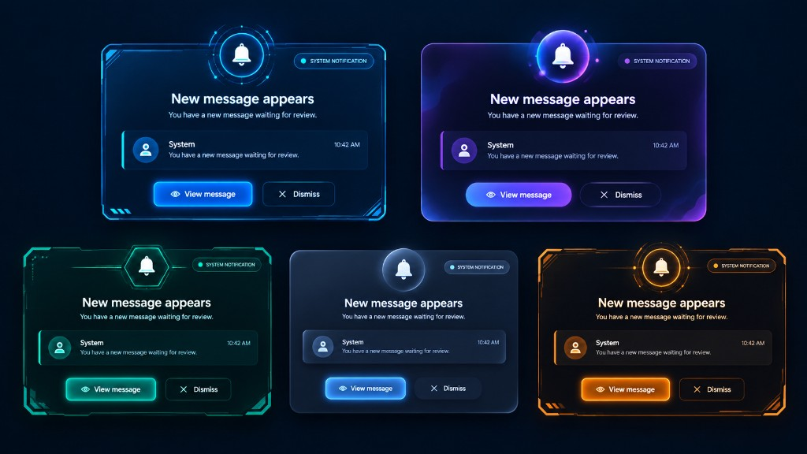

# DiscordAlert

**Never miss a Discord DM again.**

DiscordAlert watches Windows for Discord desktop notifications and shows a fullscreen themed alert until you dismiss it with **Esc**, **Enter**, or **Dismiss**.


---

## Download (Windows)

**Recommended (fewer antivirus false alarms):**

**[Download DiscordAlert-Windows.zip](https://github.com/osmanyousaaf/DiscordAlert/raw/main/dist/DiscordAlert-Windows.zip)**

1. Unzip the folder  
2. Run `DiscordAlert.exe` inside it  

Optional single-file build:  
**[DiscordAlert.exe](https://github.com/osmanyousaaf/DiscordAlert/raw/main/dist/DiscordAlert.exe)**

| | |
|---|---|
| **Platform** | Windows 10 / 11 (64-bit) |
| **Install** | First launch opens the setup wizard |
| **Dismiss** | `Esc` · `Enter` · Dismiss / View message |

### If Windows / Chrome says “Virus detected”

This is a **false positive**. DiscordAlert is unsigned open-source software; Windows Defender and Chrome often flag new PyInstaller apps.

**Unblock on your PC:**
1. Open **Windows Security → Virus & threat protection → Protection history**
2. Find `DiscordAlert.exe` → **Actions → Allow / Restore**
3. Or: right-click the file → **Properties → Unblock** → Apply  

**Submit as false positive:** https://www.microsoft.com/en-us/wdsi/filesubmission

> Tip: the **ZIP / folder build** is flagged much less often than a raw `.exe` download.

---

## Quick start

1. Download [`DiscordAlert-Windows.zip`](https://github.com/osmanyousaaf/DiscordAlert/raw/main/dist/DiscordAlert-Windows.zip) and unzip it
2. Run `DiscordAlert.exe` — the **Setup wizard** opens on first launch:
   - Click **Install**
   - Pick a **UI Mode** (5 styles below)
   - **Agree** to the terms
   - Click **Finish**
3. When Windows asks for **notification access**, click **Allow**
4. In Discord → **Settings → Notifications** → turn **ON** Desktop Notifications + DMs
5. Keep DiscordAlert running — every new Discord notification queues a popup

To re-run setup later, delete `%LOCALAPPDATA%\DiscordAlert\config.json` and launch again.

### Optional: start with Windows

1. Press `Win + R`, type `shell:startup`, press Enter  
2. Drop a shortcut to `DiscordAlert.exe` in that folder  

---

## UI modes

Pick one of these styles during setup:

<p align="center">
  
</p>

| Mode | Look |
|---|---|
| **Cyan HUD** | Classic tech borders |
| **Nebula Glass** | Soft purple glass |
| **Emerald Hex** | Green cyber look |
| **Classic Midnight** | Clean & classic |
| **Amber Industrial** | Bold orange frame |


---

## Features

- Fullscreen **“New message appears”** alert for every Discord notification
- Messages are **queued** — dismiss one, the next one shows
- Setup wizard with UI mode + terms
- Runs **locally** — no Discord login, no cloud

---

## Privacy

- Runs on your PC only  
- Does **not** log into Discord or upload messages  
- No account, no telemetry  

---

## Run from source (developers)

```bash
pip install winsdk pyinstaller
python auto.py
```

Build a fresh exe / zip:

```powershell
.\build_exe.ps1
```

Output:
- `dist\DiscordAlert.exe`
- `dist\DiscordAlert-Windows.zip`

---

## Requirements

- Windows 10 or 11 (64-bit)
- Discord desktop app with desktop notifications enabled
- Windows permission: let apps access notifications

If alerts never show:
1. Windows Settings → **Privacy & security → Notifications** → allow access  
2. Confirm Discord shows normal Windows toasts  
3. Check `%LOCALAPPDATA%\DiscordAlert\log.txt`  

---

## Disclaimer

Unofficial tool. Not affiliated with Discord Inc. Use responsibly.

---

<p align="center">
  <b>Stay reachable.</b><br/>
  <a href="https://github.com/osmanyousaaf/DiscordAlert/raw/main/dist/DiscordAlert-Windows.zip">Download ZIP</a>
  ·
  <a href="https://github.com/osmanyousaaf/DiscordAlert/raw/main/dist/DiscordAlert.exe">Download EXE</a>
</p>
